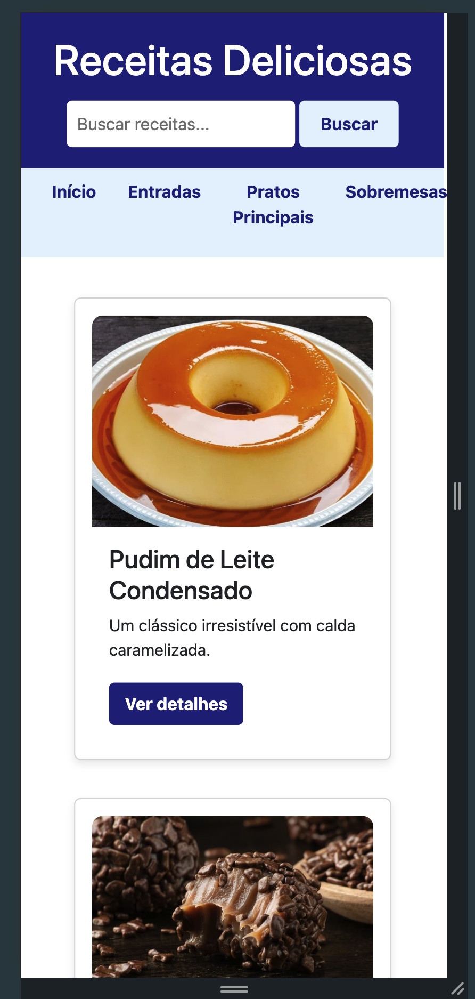

# Trabalho Prático - Semana 07

**Páginas de detalhes dinâmicas**

Nessa etapa, vamos evoluir o trabalho anterior, acrescentando a página de detalhes, conforme o  projeto escolhido. Imagine que a página principal (home-page) mostre um visão dos vários itens que existem no seu site. Ao clicar em um item, você é direcionado pra a página de detalhes. A página de detalhe vai mostrar todas as informações sobre o item do seu projeto. seja esse item uma notícia, filme, receita, lugar turístico ou evento.

Leia o enunciado completo no Canvas. 

**IMPORTANTE:** Assim como informado anteriormente, capriche na etapa pois você vai precisar dessa parte para as próximas semanas. 

**IMPORTANTE:** Você deve trabalhar e alterar apenas arquivos dentro da pasta **`public`,** mantendo os arquivos **`index.html`**, **`styles.css`** e **`app.js`** com estes nomes, conforme enunciado. Deixe todos os demais arquivos e pastas desse repositório inalterados. **PRESTE MUITA ATENÇÃO NISSO.**

## Informações Gerais

- Nome: Pedro Augusto Niess Ferreira
- Matricula: 1540911
- Proposta de projeto escolhida: Site de Receitas
- Breve descrição sobre seu projeto: Este projeto é um site de receitas onde os usuários podem explorar uma lista de pratos. A página inicial exibe receitas em cards dinâmicos, com imagem, nome e descrição. Ao clicar em uma receita, o usuário é direcionado à página de detalhes, contendo informações completas sobre ingredientes e preparo.

## Print da versão responsiva com CSS puro

